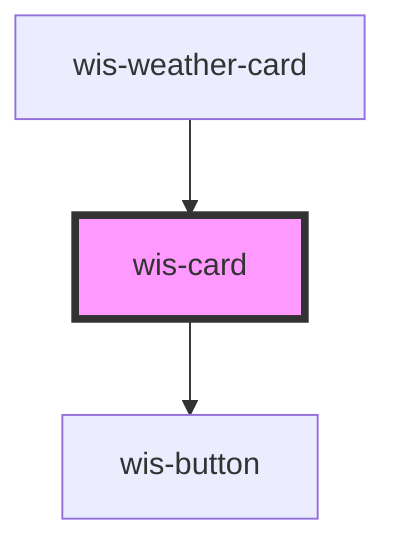

# wis-card

<!-- Auto Generated Below -->

## Properties

| Property    | Attribute    | Description | Type     | Default     |
| ----------- | ------------ | ----------- | -------- | ----------- |
| `cardTitle` | `card-title` |             | `string` | `undefined` |
| `icon`      | `icon`       |             | `string` | `undefined` |

## Dependencies

### Used by

 - [wis-weather-card](../wis-weather-card)

### Depends on

- [wis-button](../wis-button)

### Graph

----------------------------------------------

*Built with [StencilJS](https://stenciljs.com/)*
