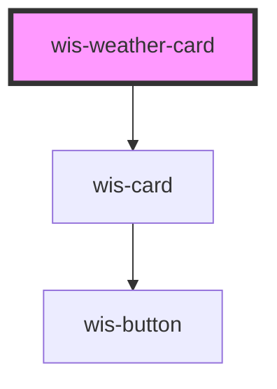

# wis-weather-card

<!-- Auto Generated Below -->

## Properties

| Property      | Attribute     | Description | Type     | Default     |
| ------------- | ------------- | ----------- | -------- | ----------- |
| `condition`   | `condition`   |             | `string` | `undefined` |
| `location`    | `location`    |             | `string` | `undefined` |
| `temperature` | `temperature` |             | `string` | `undefined` |

## Dependencies

### Depends on

- [wis-card](../wis-card)

### Graph

----------------------------------------------

*Built with [StencilJS](https://stenciljs.com/)*
